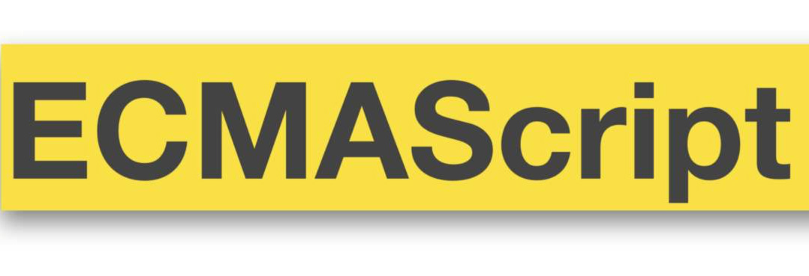
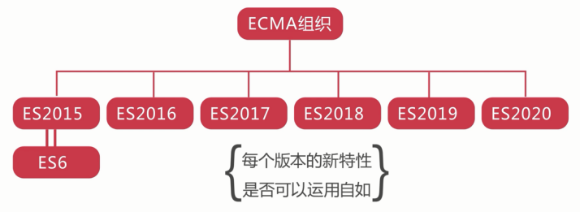
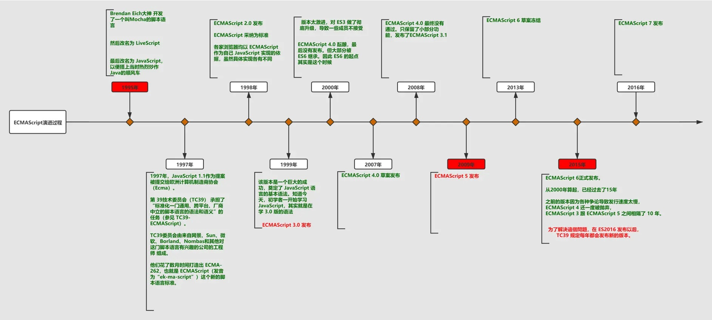
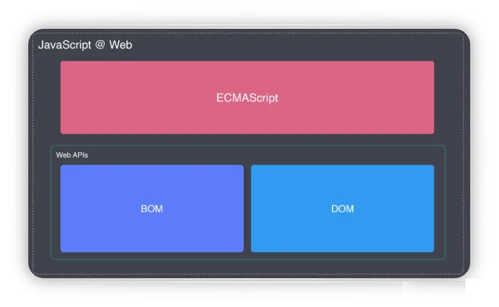
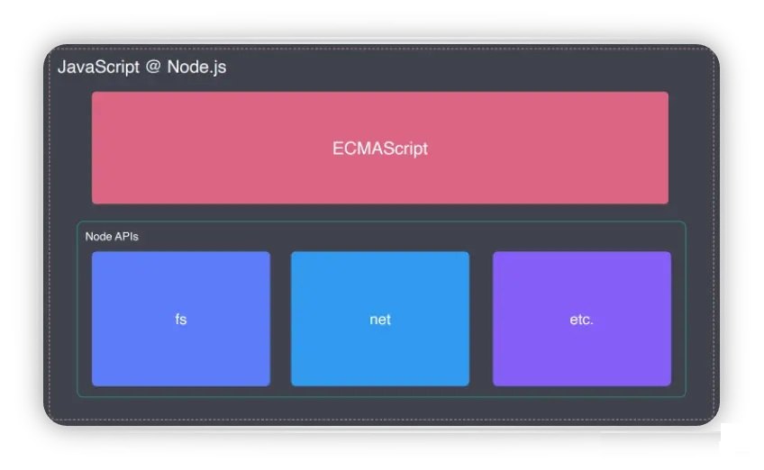
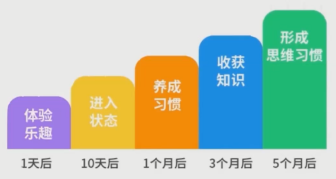
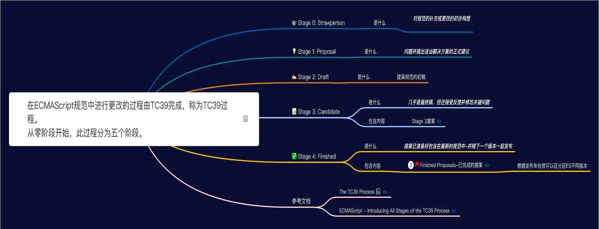

# ES Next 简述

JavaScript 是世界上发展最快的编程语言之一，不仅可以用于编写运行在浏览器的客户端程序，随着 Node.js 的发展，JavaScript 也被广泛应用于编写服务端程序。而随着 JavaScript 这门语言的不断发展和完善，在 2015 年正式发布的 ECMAScript6（2015）已经成为了 JavaScript 这门语言的下一代标准，使得 JavaScript 用来编写复杂的大型应用程序更加的得心应手。近几年几乎所有使用 JavaScript 这门语言开发的项目，都在使用 ES 的新特性来开发。

ECMAScript 和 JavaScript 的关系是，前者是后者的规格，后者是前者的一种实现（另外的 ECMAScript 方言还有 JScript 和 ActionScript）。日常场合，这两个词是可以互换的。

- ECMAScript 和 JavaScript - ECMA 是标准，JS 是实现 - 类似于 HTML5 是标准，IE10、Chrome、FF 都是实现 - 换句话说，将来也能有其他 XXXScript 来实现 ECMA - ECMAScript 简称 **ECMA 或 ES**

- 目前版本 - 低级浏览器主要支持 ES 3.1 - 高级浏览器正在从 ES5 过渡到 ES6+

学习 ES 的重要性：JS 是前端立身之本，不管框架多花哨，不会 JS 也是白扯。

随着 ES2015 的发布，标准委员会决定在每年都会发布一个 ES 的新版本。

| 时间    | ECMA   | JS      | 解释                                                                            |
| ------- | ------ | ------- | ------------------------------------------------------------------------------- |
| 1996.11 | ES 1.0 | JS 稳定 | Netscape 将 JS 提交给 ECMA 组织，ES 正式出现                                    |
| 1998.06 | ES 2.0 |         | ES2 正式发布                                                                    |
| 1999.12 | ES 3.0 |         | ES3 被广泛支持                                                                  |
| 2007.10 | ES 4.0 |         | ES4 过于激进，被废了                                                            |
| 2008.07 | ES 3.1 |         | 4.0 退化为严重缩水版的 3.1 因为吵得太厉害，所以 ES 3.1 代号为 Harmony(和谐) |
| 2009.12 | ES 5.0 |         | ES 5.0 正式发布 同时公布了 JavaScript.next 也就是后来的 ES 6.0              |
| 2011.06 | ES 5.1 |         | ES 5.1 成为了 ISO 国际标准                                                      |
| 2013.03 | ES 6.0 |         | ES 6.0 草案定稿                                                                 |
| 2013.12 | ES 6.0 |         | ES 6.0 草案发布                                                                 |
| 2015.06 | ES 6.0 |         | ES 6.0 发布正式版                                                               |

兼容性：

- http://kangax.github.io/compat-table/es5/
- http://kangax.github.io/compat-table/es6/
- https://caniuse.com/

## 为什么要学习 ECMAScript

**ECMAScript 是 JavaScript 的核心**

在浏览器中中，JavaScript 主要包含三个部分

- ECMAScript
- BOM
- DOM

Web:

Nodejs:

ECMAScript 对 JavaScript 的核心 API 进行了规范,然后 JavaScript 对其进行了实现,比如:关键字、保留字,变量，数据类型，函数，操作符...

如果要更好的学习 JavaScript， 理解 ECMAScript 及其规范 是必不可少的一环

## 怎么学？

## 理解 ECMAScript 在各浏览器的兼容性

基于现在信息呈现的载体越来越丰富，用户可以通过各种终端来浏览信息，比如 PC 端览器，PC 端应用程序，移动端浏览器等，那么相应的对前端技术人员的要求也会越来高，因此前端人员需要更多的去了解各个浏览器的特性。

那么 ECMAScript 就是一个很好的说明书。

不同的浏览器厂商均以 ECMAScript 作为自己 JavaScript 实现的依据，但具体实现各有不同有些只支持了 ES5，有些支持了 ES6，有些支持了 ES7 透过规范我们才可以知道哪些特性 API 可以直接使用，哪些特性没有在规范中(需要通过 babel 进行编译降级)

**所有浏览器都支持的版本是 ES5 , 并且 Chrome 是支持 ES 特性最多的浏览器**

- [compat-table/es6](https://kangax.github.io/compat-table/es6/)

## ECMAScript 规范是指定的 5 个阶段

在 ECMAScript 规范中进行更改的过程由 TC39 完成，称为 TC39 过程。 从零阶段开始，此过程分为五个阶段。

- Stage 0:Strawman - 对规范的补充或更改的初步构想
- Stage 1:Proposal- 提案（目的、解決方法） 问题并提出适当解决方案的正式建议
- Stage 2:Draft - 草案(提案提案规范编写初稿)
- Stage 3:Candidate -至少一个浏览器已经实现。几乎是最终稿，但还接受反馈并修改关键问题
- Stage 4:Finished - 审核完毕,至少两个浏览器已经实现,提案已准备好包含在最新的规范中-并随下一个版本一起发布

类似一个公司产品需求的完成

- Stage 0-产品提出需求
- Stage 1-组织大家进行需求评审，收集各方建议
- Stage 2-产品将收集的建议和需求进行排期
- Stage 3-实现 v1.0 需求发布到预生产环境并收集用户及公司内部反馈
- Stage 4-将反馈再进行排期实现 v2.0 并发布到正式环境

## 链接

- [ecma262](https://github.com/tc39/ecma262)
- [compat-table/es6](https://kangax.github.io/compat-table/es6/)
- [MDN JavaScript](https://developer.mozilla.org/en-US/docs/Web/JavaScript)
- [babeljs](https://www.babeljs.cn/)
