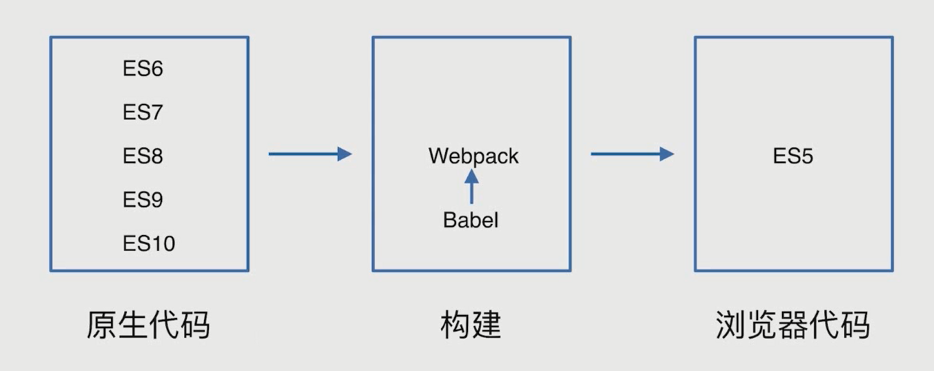
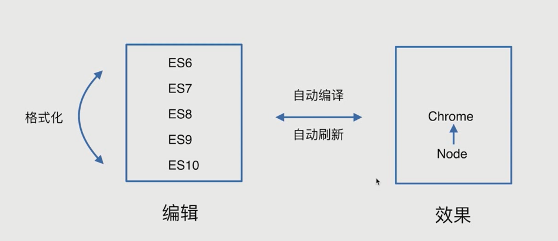

# 环境准备

构建：


开发：


## 安装 Node 环境

```bash
nvm list
nvm install 12.18.0
nvm use 12.18.0
```

验证:

```bash
node -v
npm -v
```

## 安装 NRM

NRM(Npm Registry Manager) 是 npm 的镜像源管理工具，有时候国外资源太慢，就可以使用 nrm 快速地在 npm 源间切换。

NRM 不是必装工具，如果网络环境比较好可以不安装。

全局安装 nrm

```js
npm install -g nrm
```

执行命令查看可选的源：

```js
nrm ls
```

```js
* npm -------- https://registry.npmjs.org/
  yarn ------- https://registry.yarnpkg.com/
  cnpm ------- http://r.cnpmjs.org/
  taobao ----- https://registry.npm.taobao.org/
  nj --------- https://registry.nodejitsu.com/
  npmMirror -- https://skimdb.npmjs.com/registry/
  edunpm ----- http://registry.enpmjs.org/
```

带 `*` 的是当前使用的源，上面的输出表明当前源是官方源。

如果要切换到 taobao 源，执行命令:

```js
nrm use taobao
```

查看当前使用的源：

```js
nrm current
```

测速：

```js
nrm test npm
```

增加定制源：nrm add xxx http://xxx.com

删除源：nrm del xxx
