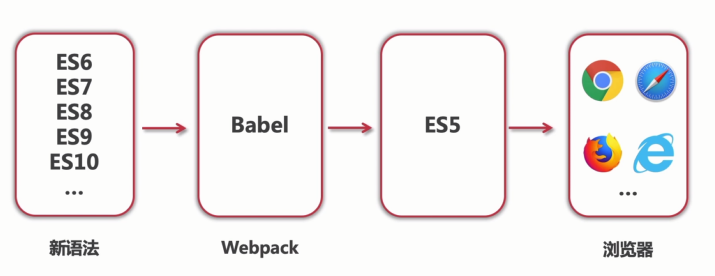

# 开发环境

完整示例[拽这里](https://github.com/ShenBao/es6-notes/tree/master/code)

## 配置项目开发环境



webpack.base.config.js

```js
'use strict';

const path = require('path');
const glob = require('glob');

const HtmlWebpackPlugin = require('html-webpack-plugin');
const CopyWebpackPlugin = require('copy-webpack-plugin');
const HardSourceWebpackPlugin = require('hard-source-webpack-plugin');

const getESPage = () => {
  const entry = {};
  const htmlWebpackPlugins = [];
  const htmlList = [];
  const entryFiles = glob.sync(path.join(__dirname, './src/**/*index.js'));

  Object.keys(entryFiles).map((index) => {
    const entryFile = entryFiles[index];
    const match = entryFile.match(/src\/(.*)\/*index\.js/);
    const pageName = match && match[1];
    if (!pageName) {
      return;
    }

    let entryJSName = `${pageName}index`;
    entry[entryJSName] = entryFile;

    let htmlTitle = pageName.replace(/\//g, ' - ');
    if (pageName.endsWith('/')) {
      htmlTitle = pageName.substring(0, pageName.length - 1);
      htmlTitle = htmlTitle.replace(/\//g, ' - ');
    }
    if (htmlTitle.endsWith('.')) {
      htmlTitle = htmlTitle.substring(0, htmlTitle.length - 1);
    }
    htmlList.push({
      title: htmlTitle,
      url: `${pageName}index.html`,
      entryJS: `${pageName}index.bundle.js`,
    });

    htmlWebpackPlugins.push(
      new HtmlWebpackPlugin({
        inlineSource: '.css$',
        template: './src/assets/template.html',
        filename: `${pageName}index.html`,
        title: htmlTitle,
        chunks: [entryJSName],
        inject: true,
        minify: {
          html5: true,
          collapseWhitespace: true,
          preserveLineBreaks: false,
          minifyCSS: true,
          minifyJS: true,
          removeComments: false,
        },
      })
    );
  });

  entry['index'] = './src/index.js';
  htmlWebpackPlugins.push(
    new HtmlWebpackPlugin({
      title: 'ECMAScript Next 学习笔记',
      template: './src/assets/index.html',
      chunks: ['index'],
      list: JSON.stringify(htmlList),
      minify: {
        html5: true,
        collapseWhitespace: true,
        preserveLineBreaks: false,
        minifyCSS: true,
        minifyJS: true,
        removeComments: false,
      },
    })
  );

  return {
    entry,
    htmlWebpackPlugins,
  };
};

const {entry, htmlWebpackPlugins} = getESPage();

module.exports = {
  entry: entry,
  output: {
    path: path.join(__dirname, 'dist'),
    filename: '[name].bundle.js',
  },
  mode: 'production',
  module: {
    rules: [
      {
        test: /\.css$/,
        use: ['style-loader', 'css-loader'],
      },
      {
        test: /\.js$/,
        use: ['babel-loader?cacheDirectory'],
        include: path.resolve(__dirname, 'src'),
      },
    ],
  },
  plugins: [
    new CopyWebpackPlugin({
      patterns: [
        {
          from: __dirname + '/src/static',
          to: __dirname + '/dist/static',
        },
      ],
    }),
    new HardSourceWebpackPlugin(),
    ...htmlWebpackPlugins,
  ],
  performance: {
    hints: 'warning',
    maxEntrypointSize: 50000000,
    maxAssetSize: 30000000,
    assetFilter: function (assetFilename) {
      return assetFilename.endsWith('.js');
    },
  },
  resolve: {
    alias: {
      '@lib': path.resolve(__dirname, 'src/lib'),
    },
  },
};
```

webpack.dev.config.js

```js
'use strict';

const baseConfig = require('./webpack.base.config');

const {merge} = require('webpack-merge');

module.exports = merge(baseConfig, {
  devtool: 'cheap-module-eval-source-map',
});
```

webpack.pro.config.js

```js
'use strict';

const baseConfig = require('./webpack.base.config');

const {merge} = require('webpack-merge');
const {CleanWebpackPlugin} = require('clean-webpack-plugin');

module.exports = merge(baseConfig, {
  devtool: 'hidden-source-map',
  plugins: [new CleanWebpackPlugin()],
});
```

settings.json

```json
{
  "eslint.autoFixOnSave": true,
  "prettier.eslintIntegration": true,
  "prettier.semi": false,
  "prettier.singleQuote": true,
  "javascript.format.insertSpaceBeforeFunctionParenthesis": true,
  "vetur.format.defaultFormatter.html": "js-beautify-html",
  "vetur.format.defaultFormatter.js": "vscode-typescript",
  "vetur.format.defaultFormatterOptions": {
    "js-beautify-html": {
      "wrap_attributes": "force-aligned"
    }
  },
  "eslint.validate": [
    "javascript",
    "html"
  ],
  "eslint.options": {
    "plugins": ["html"]
  },
  "window.zoomLevel": 1,
  "editor.formatOnSave": true,
  "html.format.enable": false,
  "html.format.indentHandlebars": true,
  "html.format.preserveNewLines": true,
  "workbench.sideBar.location": "left"
}
```

package.json

```js
{
  "name": "es6-notes-code",
  "version": "1.0.0",
  "description": "",
  "main": "index.js",
  "scripts": {
    "dev": "webpack-dev-server --open --config webpack.development.config.js",
    "build": "webpack --config webpack.production.config.js"
  },
  "keywords": [],
  "author": "",
  "license": "ISC",
  "devDependencies": {
    "@babel/core": "^7.10.5",
    "@babel/plugin-transform-runtime": "^7.10.5",
    "@babel/preset-env": "^7.10.4",
    "@babel/preset-react": "^7.10.4",
    "babel-loader": "^8.1.0",
    "clean-webpack-plugin": "^3.0.0",
    "copy-webpack-plugin": "^6.0.3",
    "css-loader": "^3.6.0",
    "glob": "^7.1.6",
    "hard-source-webpack-plugin": "^0.13.1",
    "html-webpack-plugin": "^4.3.0",
    "style-loader": "^1.2.1",
    "webpack": "^4.43.0",
    "webpack-cli": "^3.3.12",
    "webpack-dev-server": "^3.11.0",
    "webpack-merge": "^5.0.9"
  },
  "dependencies": {
    "core-js": "^3.6.5",
    "react": "^16.13.1",
    "react-dom": "^16.13.1"
  }
}
```

## 开发工具

[vs code](https://code.visualstudio.com/)

VSCode 插件 beautify 和 ESLint
