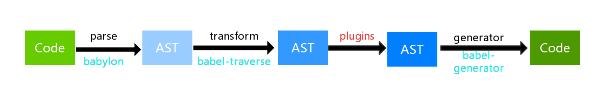
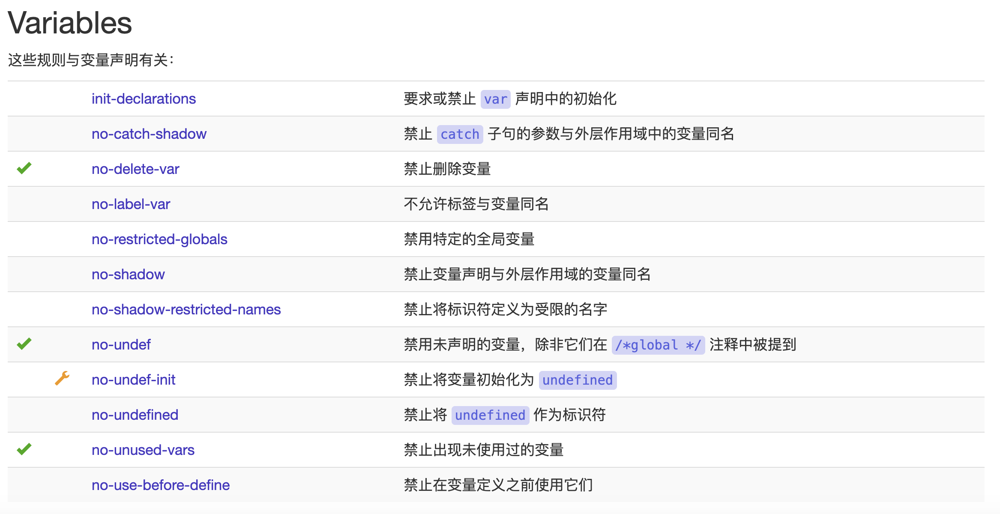

# 扩展：现代前端环境

## **Webpack**

- 中文文档：https://webpack.docschina.org/concepts/

本质上，webpack 是一个现代 JavaScript 应用程序的静态模块打包工具。当 webpack 处理应用程序时，它会在内部构建一个 依赖图(dependency graph)，此依赖图会映射项目所需的每个模块，并生成一个或多个 bundle。

### 入口(entry)

入口起点(entry point) 告诉 webpack 那个是原始文件。找到这个原始文件之后开始寻找依赖包和各种资源，根据这些包还有资源选择合适的 loader 进行处理。
这个入口是需要在 webpack 的配置文件（webpack.config.js）中来声明的：

```js
module.exports = {
    entry: './path/to/my/entry/file.js'
};
```

### 出口(output)

所谓的 **出口（output）**是告诉 webpack 经过各种 loader 处理后的文件应该生成到哪个目录下，也就是生成文件所在的地方。同样，需要显示的告诉 webpack 的配置文件（webpack.config.js）：

```js
const path = require('path');
      
module.exports = {
    entry: './path/to/my/entry/file.js',
    output: {
        path: path.resolve(__dirname, 'dist'),
        filename: 'my-first-webpack.bundle.js'
    }
};
```

## loader

构建的过程除了处理原生的 JavaScript，还需要处理其他非 JavaScript 文件，比如图片、CSS、ES6等等。webpack loader 的作用就是提供一个机制能保证所有的类型资源都可以采用对应的 loader 进行处理，这样 webpack 就能完成更加复杂的构建过程。而这个 loader 也是需要在配置文件（webpack.config.js）中来定义的：

```js
const path = require('path');
      
const config = {
    output: {
        filename: 'my-first-webpack.bundle.js'
    },
    module: {
        rules: [
        { test: /\.txt$/, use: 'raw-loader' }
        ]
    }
};

module.exports = config;
```

这里的 module 模块就是用来定义不同 loader 的。其中 rules 选项中有两个配置，一个是 test，一个是 use。test 来填写资源类型的正则表达式，use 制定所要使用的 loader。

### 插件(plugins)

loader 被用于转换某些资源类型的模块，而插件则可以用于执行范围更广的任务。插件的范围包括打包、优化和压缩、重新定义环境中的变量。插件接口功能极其强大，可以用来处理各种各样的任务。

想要使用一个插件，你只需要 require() 它，然后把它添加到 plugins 数组中。多数插件可以通过选项(option)自定义。你也可以在一个配置文件中因为不同目的而多次使用同一个插件，这时需要通过使用 new 操作符来创建它的一个实例。

```js
const HtmlWebpackPlugin = require('html-webpack-plugin'); // 通过 npm 安装
const webpack = require('webpack'); // 用于访问内置插件

const config = {
    module: {
        rules: [
        { test: /\.txt$/, use: 'raw-loader' }
        ]
    },
    plugins: [
        new HtmlWebpackPlugin({template: './src/index.html'})
    ]
};

module.exports = config;
```

### 模式

我们平时会存在两种状态：开发模式、生产模式。构建的过程中也是需要的，比如我们在开发环境需要快速的构建，在生产环境需要构建一个最符合线上环境的版本。这样我们只要在配置文件中（webpack.config.js）简单的配置一下就可以达到目的：

```js
module.exports = {
    mode: 'production'
};
```

## **Babel**

Babel 是一个工具链，主要用于将 ECMAScript 2015+ 版本的代码转换为向后兼容的 JavaScript 语法，以便能够运行在当前和旧版本的浏览器或其他环境中。

```js
// Babel 输入： ES2015 箭头函数
[1, 2, 3].map((n) => n + 1)

// Babel 输出： ES5 语法实现的同等功能
[1, 2, 3].map(function(n) {
return n + 1
})
```

### 工作原理

从上述的代码中可以看出 Babel 是从一种代码转换成另一种代码，基本的工作流程如下：



### 选择场景

这个[链接](https://www.babeljs.cn/setup#installation)用来说明 Babel 的应用场景，从浏览器、构建工具、框架到模板引擎、调试器等等，如何使用 Babel，首先要选择应用场景，再根据对应的教程安装对应的工具。

### 安装工具

因为每个应用场景的安装方式不同，我们选择 Webpack，这是前端开发工程师必备技能之一。

```bash
npm install --save-dev babel-loader @babel/core @babel/preset-env
```

安装成功之后，要在 webpack.config.js 中进行简单的开启 Babel：

```js
module: {
    rules: [
        { test: /\.js$/, exclude: /node_modules/, loader: "babel-loader" }
    ]
}
```

### 配置文件

Babel 的工作原理是利用各种 plugin 对 AST 做转换，上面的安装只是开启了 Babel，还没有选择使用哪些 plugin，接下来就是进行 plugin 的配置，请在项目的根目录创建 .babelrc 文件，文件的内容如下：

```js
{
    "presets": ["@babel/preset-env"]
}
```

presets 和 plugins 是什么关系？一句话总结：presets 是 plugin 的集合。


## **ESlint**

ESLint最初是由Nicholas C. Zakas 于2013年6月创建的开源项目。它的目标是提供一个插件化的、可组装的 JavaScript 和 JSX 检查工具。

### 规则

首先 ESLint 是一个工具，无论是常规的 JavaScript 项目还是 React、Vue 等项目，都可以使用它进行代码检查并格式化。ESLint 对代码的检查都基于"规则"，这些规则可以是官方内置的也可以是开发者自定义的。当然，内置的规则还进行了分类，比如 Variables 规则：



每个规则会设置三个检查等级：

- "off" 或 0 - 关闭规则
- "warn" 或 1 - 开启规则，使用警告级别的错误：warn (不会导致程序退出)
- "error" 或 2 - 开启规则，使用错误级别的错误：error (当被触发的时候，程序会退出)

```js
{
    "rules": {
        "eqeqeq": "off",
        "curly": "error",
        "quotes": ["error", "double"]
    }
}
```

### 插件

ESLint通过插件的机制来拓展规则的建设、也就是说插件是用来自定义规则的，也可以使用他人开发的插件也可以自己开发插件。

插件的命名方式是：`eslint-plugin-<plugin-name>`，比较流行的 ESLint 插件有 eslint-plugin-standard、eslint-plugin-vue、eslint-pugin-react、eslint-plugin-prettier、eslint-plugin-node。

### 配置

ESlint 被设计为完全可配置的，这意味着你可以关闭每一个规则而只运行基本语法验证，或混合和匹配 ESLint 默认绑定的规则和你的自定义规则，以让 ESLint 更适合你的项目。有两种主要的方式来配置 ESLint：

1. Configuration Comments - 使用 JavaScript 注释把配置信息直接嵌入到一个代码源文件中。

2. Configuration Files - 使用 JavaScript、JSON 或者 YAML 文件为整个目录（处理你的主目录）和它的子目录指定配置信息。可以配置一个独立的 .eslintrc.* 文件，或者直接在 package.json 文件里的 eslintConfig 字段指定配置，ESLint 会查找和自动读取它们，再者，你可以在命令行运行时指定一个任意的配置文件。

以 .eslintrc.json 文件示例：

```js
{
    "parserOptions": {
        "ecmaVersion": 6,
        "sourceType": "module",
        "ecmaFeatures": {
            "jsx": true
        }
    },
    "rules": {
        "semi": 2
    }
}
```

在这个配置文件中，rules 选项很容易理解，就是我们前面所说的 ESLint 规则。ESLint 支持 ES6 语法并不意味着同时支持新的 ES6 全局变量或类型，这个时候就需要用到 parserOptions 配置了。具体的可以参考 [parserOptions](http://eslint.cn/docs/user-guide/configuring) 配置。

那如何使用 ESLint 的内置规则呢？

```js
{
    "extends": "eslint:recommended",
    "rules": {
        "indent": ["error", 4],
        "linebreak-style": ["error", "unix"],
        "quotes": ["error", "double"],
        "semi": ["error", "always"],
        "comma-dangle": ["error", "always"],
        "no-cond-assign": ["error", "always"],
        "no-console": "off",
    }
}
```

extends 选项就是指定 rules 集合，比如内置的规则、他人的规则配置等。这个选项的值可以是字符串也可以是数组，上边的配置是字符串，我们再看下数组：

```js
{
    "extends": [
        "eslint:recommended",
        "plugin:react/recommended"
    ],
    "rules": {
        "no-set-state": "off"
    }
}
```

这个配置描述的是使用多个 rules 集合，并使用了 eslint-plugin-react 插件。

### 使用

1. 安装

npm i -g eslint
      
2. 创建配置文件

eslint --init
      
这个是命令行交互的方式助你自动生成配置文件，推荐用 eslint-plugin-standard。

3. 检查

eslint --fix filename.js

> 通常不会使用 eslint --fix 去检查，而是配置好 IDE 在保存代码的时候自动检查并格式化。

