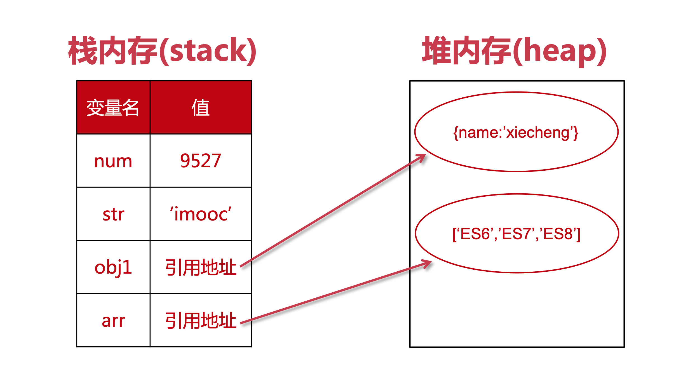

# Let & Const

## Let

ES6 新增了 `let` 命令，用来声明变量。

### 1. let 声明的全局变量不是全局对象 window 的属性

这就意味着，不可以通过 `window.变量名` 的方式访问这些变量，而 var 声明的全局变量是 window 的属性，是可以通过 `window.变量名` 的方式访问的。 `let 声明的全局变量不是全局对象的属性`。

```js
var a = 5;
console.log(window.a); // 5

let a = 5;
console.log(window.a); // undefined
```

### 2. 用 let 定义变量不允许重复声明（重定义变量会抛出一个语法错误）

这个很容易理解，使用 var 可以重复定义，使用 let 却不可以。

```js
var a = 5;
var a = 6;

console.log(a); // 5
```

如果是 let ，则会报错

```js
let a = 5;
let a = 6;
// VM131:1 Uncaught SyntaxError: Identifier 'a' has already been declared
//   at <anonymous>:1:1
```

### 3. let 声明的变量不存在变量提升

```js
function foo() {
  console.log(a);
  var a = 5;
}

foo(); //undefined
```

上述代码中， a 的调用在声明之前，所以它的值是 undefined，而不是 Uncaught ReferenceError。实际上因为 var 会导致变量提升，上述代码和下面的代码等同：

```js
function foo() {
  var a;
  console.log(a);
  a = 5;
}

foo(); //undefined
```

而对于 let 而言，变量的调用是不能先于声明的，如下代码：

```js
function foo() {
  console.log(a);
  let a = 5;
}

foo();
// Uncaught ReferenceError: Cannot access 'a' before initialization
```

在这个代码中， a 的调用是在声明之前，因为 let 没有发生变量提升，所有读取 a 的时候，并没有找到，而在调用之后才找到 let 对 a 的定义，所以按照 tc39 的定义会报错。

### 4. let 声明的变量具有暂时性死区

只要块级作用域内存在 let 命令，它所声明的变量就绑定在了这个区域，不再受外部的影响。

```js
var a = 5;
if (true) {
  a = 6;
  let a;
}
// Uncaught ReferenceError: Cannot access 'a' before initialization
```

上面代码中，存在全局变量 a ，但是块级作用域内 let 又声明了一个局部变量 a ，导致后者绑定这个块级作用域，所以在 let 声明变量前，对 a 赋值会报错。

ES6 明确规定，如果区块中存在 let 和 const 命令，这个区块对这些命令声明的变量，从一开始就形成了封闭作用域。凡是在声明之前就使用这些变量，就会报错。

总之，在代码块内，使用 let 命令声明变量之前，该变量都是不可用的。这在语法上，称为"暂时性死区"

有时"暂时性死区"比较隐蔽，比如：

```js
function foo(b = a, a = 2) {
  console.log(a, b);
}
foo();
// Uncaught ReferenceError: Cannot access 'a' before initialization
```

### 5. let 声明的变量拥有块级作用域

let 实际上为 JavaScript 新增了块级作用域

```js
{
  let a = 5;
}
console.log(a); // undefined
```

a 变量是在代码块 `{}` 中使用 let 定义的，它的作用域是这个代码块内部，外部无法访问。

再看一个项目中很常见的 for 循环:

```js
for (var i = 0; i < 3; i++) {
  console.log('循环内:' + i); // 0、1、2
}
console.log('循环外:' + i); // 3
```

如果改为 let 会怎么样呢？

```js
for (let i = 0; i < 3; i++) {
  console.log('循环内:' + i); // 0、1、2
}
console.log('循环外:' + i); // ReferenceError: i is not defined
```

继续看下面两个例子的对比，这时 a 的值又是多少呢？

```js
if (false) {
  var a = 5;
}
console.log(a); // undefined

if (false) {
  let a = 5;
}
console.log(a);
// Uncaught ReferenceError: a is not defined
```

### 问题

请问 i 的值是多少？

```js
for (var i = 0; i < 3; i++) {
  setTimeout(function () {
    console.log(i);
  });
}
// 3、3、3
```

答案是 3 次 3。

但希望的值是 0、1、2，也就是每次保存住循环时候 i 的值，应该如何做呢？

方案 1：闭包

```js
for (var i = 0; i < 3; i++) {
  (function (j) {
    setTimeout(function () {
      console.log(j);
    });
  })(i);
}
```

方案 2：使用 let

```js
for (let i = 0; i < 3; i++) {
  setTimeout(function () {
    console.log(i);
  });
}
```

把上面这段代码粘贴到 babel 中：https://www.babeljs.cn/repl , 看下经过 babel 转化为的 ES5 代码是什么样子的。

会发现其实 babel 把这段代码转化成了闭包的形式:

```js
'use strict';

var _loop = function _loop(i) {
  setTimeout(function () {
    console.log(i);
  });
};

for (var i = 0; i < 3; i++) {
  _loop(i);
}
```

经典问题：`循环事件绑定`

### 总结

使用 let 声明的变量：

- 不属于顶层对象 window
- 不允许重复声明
- 不存在变量提升
- 暂时性死区
- 块级作用域

### 链接

- [内存管理](https://developer.mozilla.org/zh-CN/docs/Web/JavaScript/Memory_Management)
- [let])(https://developer.mozilla.org/zh-CN/docs/Web/JavaScript/Reference/Statements/let)

## Const

不能被改变的叫做常量，在 ES5 中如何定义一个常量呢？

ES5 中可以使用 `Object.defineProperty()` 来实现定义常量：

```js
Object.defineProperty(window, 'PI', {
  value: 3.14,
  writable: false,
});
console.log(PI);
PI = 5;
console.log(PI);
```

const 除了具有 let 的块级作用域和不会变量提升外，还有就是它定义的是常量，在用 const 定义变量后，就不能修改它了，对变量的修改会抛出异常。

```js
const PI = 3.1415;

console.log(PI);

PI = 5;

console.log(PI);
// Uncaught TypeError: Assignment to constant variable.
```

这个代码块中因为对 PI 尝试修改，导致浏览器报错，这就说明 const 定义的变量是不能被修改的，它是只读的。

会发现只读属性是不是一定要进行初始化呢？

```js
const PI

PI = 3.1415
// Uncaught SyntaxError: Missing initializer in const declaration
```

`const 声明的变量必须进行初始化，不然会抛出异常 Uncaught SyntaxError: Missing initializer in const declaration。`

### const 定义对象

```js
const obj = {
  name: 'ZhangSan',
  age: 18,
};
obj.school = 'xxx';
console.log(obj);

const arr = [1, 2, 3];
arr.push(4);
```

会发现 const 定义的 obj 竟然被改变了... 这到底是为什么呢？有点懵啊...



基本数据类型存储在 `栈内存` 中，引用数据类型存储在 `堆内存` 中然后在栈内存中保存 `引用地址` 。

const 实际上保证的并不是变量的值不得改动，而是变量指向的那个内存地址所保存的数据不得改动。

如何让对象或者数组这种引用数据类型也不被改变呢？

```js
Object.freeze(obj);
```

`Object.freeze() 只是浅层冻结`，只会对最近一层的对象进行冻结，并不会对深层对象冻结。

### 总结

使用 const 声明的常量：

- 不属于顶层对象 window
- 不允许重复声明
- 不存在变量提升
- 暂时性死区
- 块级作用域

## 链接

- [const MDN](https://developer.mozilla.org/zh-CN/docs/Web/JavaScript/Reference/Statements/const)
