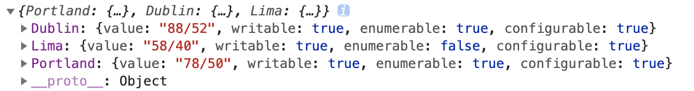

# Object

ES8 中对象扩展补充:
- Object.values()
- Object.entries()
- Object.getOwnPropertyDescriptors()

## 前置

之前的语法如何获取对象的每一个属性值

```js
const obj = {
  name: 'test',
  web: 'www.test.com',
  course: 'es',
};
console.log(Object.keys(obj));
const res = Object.keys(obj).map((key) => obj[key]);
console.log(res);
// ["test", "www.test.com", "es"]
```

Iterator 方式遍历:

```js
let grade = {
  lilei: 95,
  hanmei: 97,
  lisi: 99,
};

grade[Symbol.iterator] = function () {
  let All = this;
  let keys = Reflect.ownKeys(grade);
  let values = [];
  // console.log(All, keys, '内部数据')
  return {
    next() {
      if (!values.length) {
        if (keys.length - 1) {
          values.push(All[keys[0]]);
          keys.shift();
          // console.log(values, values.length, All[keys[0]], keys, '内部')
        }
      }
      return {
        done: !values.length,
        value: values.shift(),
      };
    },
  };
};

let result = [];
for (let v of grade) {
  result.push(v);
}
console.log(result);
//  [95, 97, 99]
```

ES8 中对象扩展补充了两个静态方法，用于遍历对象：Object.values()，Object.entries()

## Object.values()

Object.values() 返回一个数组，其元素是在对象上找到的可枚举属性值。属性的顺序与通过手动循环对象的属性值所给出的顺序相同(for...in，但是 for...in 还会遍历原型上的属性值)。

```js
const obj = {
  name: 'test',
  web: 'www.test.com',
  course: 'es',
};
console.log(Object.values(obj));
```

Object.values 是在对象上找到可枚举的属性的值，所以只要这个对象是可枚举的就可以，不只是 {} 这种形式。

## Object.entries()

Object.entries()方法返回一个给定对象自身可枚举属性的键值对数组，其排列与使用 for...in 循环遍历该对象时返回的顺序一致。（区别在于 for-in 循环也枚举原型链中的属性）

```js
let grade = {
  lilei: 98,
  hanmei: 87,
};

for (let [key, value] of grade) {
  console.log(key, value); // Uncaught TypeError: grade is not iterable
}
```

Object 是不可直接遍历的，上述代码足以说明直接遍历触发了错误。如果使用 Object.entries() 则可以完成遍历任务。

```js
let grade = {
  lilei: 98,
  hanmei: 87,
};

for (let [k, v] of Object.entries(grade)) {
  console.log(k, v);
  // lilei 98
  // hanmei 87
}
```

这段代码确实成功的遍历了出来，但是上边说过 Object.entries 返回的是数组，这里面还用了数组的解构赋值

```js
let grade = {
  lilei: 98,
  hanmei: 87,
};
// "[
//     [
//         "lilei",
//         98
//     ],
//     [
//         "hanmei",
//         87
//     ]
// ]"
```

## Object.getOwnPropertyDescriptors()

想理解 Object.getOwnPropertyDescriptors 这个方法之前，首先要弄懂什么是描述符(descriptor)？

- value [属性的值]
- writable [属性的值是否可被改变]
- enumerable [属性的值是否可被枚举]
- configurable [描述符本身是否可被修改，属性是否可被删除]

```js
const data = {
  Portland: '78/50',
  Dublin: '88/52',
  Lima: '58/40',
};
```

还是上述那个对象，这里有 key 和 value，上边的代码把所有的 key、value 遍历出来，如果不想让 Lima 这个属性和值被枚举怎么办？

```js
Object.defineProperty(data, 'Lima', {
  enumerable: false, // 是否可枚举
  writable: false, // 是否可写
});

Object.entries(data).map(([city, temp]) => {
  console.log(`City: ${city.padEnd(16)} Weather: ${temp}`);
  // City: Portland         Weather: 78/50
  // City: Dublin           Weather: 88/52
});
```

很成功，Lima 没有被遍历出来，那么 defineProperty 的第三个参数就是描述符(descriptor)。这个描述符包括几个属性：

```js
console.log(Object.getOwnPropertyDescriptor(data, 'Lima'));
// {value: "58/40", writable: true, enumerable: false, configurable: true}
```

这个是获取对象指定属性的描述符，如果想获取对象的所有属性的描述符：

```js
console.log(Object.getOwnPropertyDescriptors(data));
```

返回数据：



如何获取 Object 数据的描述符

- `Object.defineProperty(data, 'Lima', { enumerable: false})` : 设置属性描述符
- `Object.getOwnPropertyDescriptor(data, 'Lima')` : 查询一项
- `Object.getOwnPropertyDescriptors(data)` : 查询所有

## 链接

- [Object.values()](https://developer.mozilla.org/zh-CN/docs/Web/JavaScript/Reference/Global_Objects/Object/values)
- [Object.entries()](https://developer.mozilla.org/zh-CN/docs/Web/JavaScript/Reference/Global_Objects/Object/entries)
- [Object.defineProperty()](https://developer.mozilla.org/zh-CN/docs/Web/JavaScript/Reference/Global_Objects/Object/defineProperty)
- [Object.getOwnPropertyDescriptors()](https://developer.mozilla.org/zh-CN/docs/Web/JavaScript/Reference/Global_Objects/Object/getOwnPropertyDescriptors)
