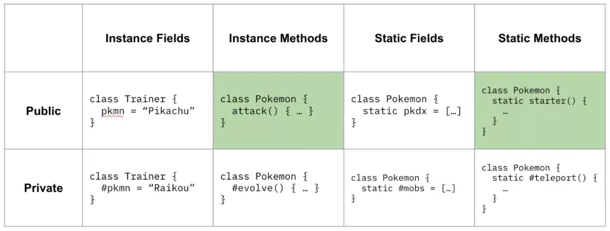
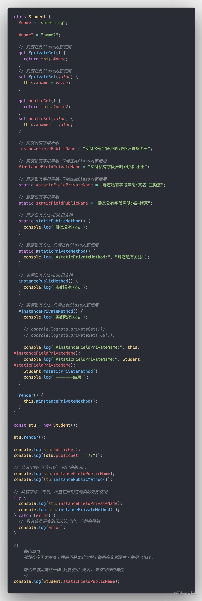
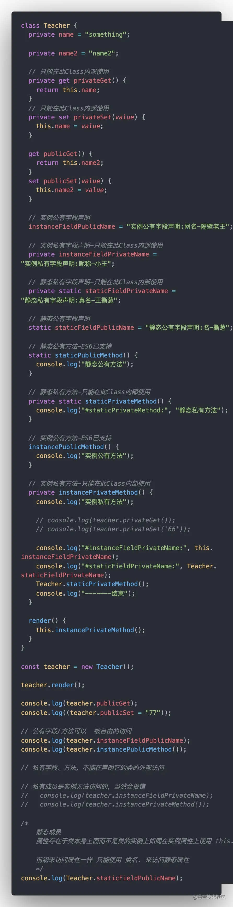

# Class Fields (Class 字段相关特性)

2022 提案为 ECMAScript Class 新增了下表中所描述的特性（绿色为现有特性）



Class Fields :

- 存值函数 setter
- 取值函数 getter
- 使用声明式的字段
- 使用 # 来表示私有方法和私有字段
  - 字段
  - 方法
  - static
  - getter
  - getter

## 面向对象的一些概念

- public ：
  - 可以自由的访问类中定义的成员；
  - 在 TS 中成员默认为 public
- private ：
  - 不能再声明它的类的外部访问；
- protected ：
  - 不能再声明它的类的外部访问；
  - 但是可以在派生类中仍然可以访问；
- static ：
  - 属性存在于类本身上面而不是类的实例上；
  - 如同在实例属性上使用 this. 前缀来访问属性一样，这里我们使用“类名”来访问静态属性
- abstract：
  - 抽象类作为其他派生类的基类使用。他们一般不会直接被实例化
  - abstract 关键字是用于定义抽象类和在抽象类内部定义抽象方法
  - 抽象类中抽象方法不包含具有实现并且必须在派生类中实现
- constructor

## 使用声明式的类字段

从 ES6 Class 开始，我们就可以在 JavaScript 中使用 class 关键字书写传统面向对象编程范式的代码了。

但是在 ES6 版本的 Class 中，我们只能给这个类创建可以公共访问的实例方法和静态方法，如果希望声明类字段的话，只能在 constructor 中直接通过向 this 赋值实现：

```js
class Pokemon {
  constructor() {
    this.name = "JS";
  }
  attack() {}
  static starter() {}
}
```

这种方式对于工程上实践与代码阅读者来说并不直观。

我们更希望有声明式的类字段，便于代码阅读者了解这个类的数据结构，不需要阅读过程代码就快速地了解这个类的全貌。

在 ES2022 的提案中,我们就可以使用声明式的类字段了

```js
class Pokemon {
  name = "Pokemon";

  attack() {}
  static starter() {}
}
```

提案所包含的特性目前已经在 Chrome 74，Node 12，Safari ，TypeScript 3.8，Babel 7.0+ 等等环境中使用

## 私有属性/私有方法

最新提案之一是在类中添加私有变量的方法。

我们将使用 `# 符号表示类的私有变量`。这样就不需要使用闭包来隐藏不想暴露给外界的私有变量。

通过 `#` 修饰的成员变量或成员函数就成为了私有变量，如果试图在 Class 外部访问，则会抛出异常。现在，此特性可在最新版本的 Chrome 和 Node.js 中使用。

```js
class Student {
  #name = "something";

  #name2 = "name2";

  // 实例私有方法-只能在此Class内部使用
  #instancePrivateMethod() {
    console.log("实例私有方法");
  }
}
```

## static 字段

它允许类拥有静态字段，类似于大多数 OOP 语言。静态字段可以用来代替枚举，也可以用于私有字段。

```ts
class Student {
  // 静态私有字段声明-只能在此Class内部使用
  static #staticFieldPrivateName = "静态私有字段声明:真名-王撕葱";

  // 静态公有字段声明
  static staticFieldPublicName = "静态公有字段声明:名-撕葱";

  // 静态公有方法-ES6已支持
  static staticPublicMethod() {
    console.log("静态公有方法");
  }

  // 静态私有方法-只能在此Class内部使用
  static #staticPrivateMethod() {
    console.log("#staticPrivateMethod:", "静态私有方法");
  }
}
```

## JavaScript 类的私有方法和 getter / setter

在“类”的内部可以使用 get 和 set 关键字，对某个属性设置存值函数和取值函数，拦截该属性的存取行为。

上面代码中，prop 属性有对应的存值函数和取值函数，因此赋值和读取行为都被自定义了。

私有属性也可以设置 getter 和 setter 方法

```js
class Student {
  #name = "something";

  #name2 = "name2";

  // 只能在此Class内部使用
  get #privateGet() {
    return this.#name;
  }
  // 只能在此Class内部使用
  set #privateSet(value) {
    this.#name = value;
  }

  get publicGet() {
    return this.#name2;
  }
  set publicSet(value) {
    this.#name2 = value;
  }
}
```

## 静态公有/私有字段

场景: 当做枚举来使用

```js
class ColorFinder {
  static #red = "#ff0000";
  static #green = "#00ff00";
  static #blue = "#0000ff";

  static colorName(name) {
    switch (name) {
      case "red":
        return ColorFinder.#red;
      case "blue":
        return ColorFinder.#blue;
      case "green":
        return ColorFinder.#green;
      default:
        throw new RangeError("unknown color");
    }
  }

  // Somehow use colorName
}
```

## Class 字段总结

<!--  -->
```js
class Student {
  #name = "something";

  #name2 = "name2";

  //  只能在此 class 内部调用
  get #privateGet() {
    return this.#name;
  }

  //  只能在此 class 内部调用
  set #privateSet(value) {
    this.#name = value;
  }

  get publicGet() {
    return this.#name2;
  }
  set publicSet(value) {
    this.#name2 = value;
  }

  //   实例公有字段声明
  instanceFieldPublicName = "实例公有字段声明：隔壁老王";

  //   实例私有字段声明，只能在此 class 内部使用
  #instanceFieldPrivateName = "实例私有字段声明：小王";

  //  静态私有字段声明- 只能在此class 内部使用

  static #staticFieldPrivateName = "静态私有字段声明：王撕葱";

  // 静态公有字段声明
  static staticFieldPublicName = "静态公有字段声明：刘大海";

  // 静态公有方法，ES6已支持
  static staticPublicMethod() {
    console.log("静态公有方法");
  }

  // 静态私有方法，只能在 class 内部调用
  static #staticPrivateMethod() {
    console.log("静态私有方法");
  }

  // 实例公有方法，ES6已支持
  instancePublicMethod() {
    console.log("实例公有方法");
  }

  // 实例私有方法，只能在此 class 内部使用
  #instancePrivateMethod() {
    console.log("实例私有方法");

    // console.log(stu.publicGet())
    // console.log(stu.publicSet("66"))

    console.log("#instanceFieldPrivateName", this.#instanceFieldPrivateName);
    console.log("#instanceFieldPrivateName", Student.#staticFieldPrivateName);

    Student.#staticPrivateMethod();
    console.log("------ end");
  }

  render() {
    this.#instancePrivateMethod();
  }
}

const stu = new Student();
stu.render();

console.log(stu.publicGet);
console.log((stu.publicSet = 77));

// 公有字段、方法可以被自由的访问

console.log(stu.instanceFieldPublicName);
console.log(stu.instancePublicMethod());

// 私有字段、方法，不能再声明它的类外部访问

try {
  console.log(stu.instanceFieldPublicName);
  console.log(stu.instancePrivateMethod());
} catch (error) {
  // 私有成员是实例无法访问的，报错
  console.log(error);
}

// 静态成员
// 属性存在于类本身上面而不是类的实例上，如同在实例属性上使用 this
// 前缀来访问属性一样，只能使用”类名“来访问静态属性

console.log(Student.staticFieldPublicName);
```

**与 TypeScript 的对比：**

<!--  -->
```ts
class Teacher {
  private name = "something";

  private name2 = "name2";

  //  只能在此 class 内部调用
  private get privateGet() {
    return this.name;
  }

  //  只能在此 class 内部调用
  private set privateSet(value) {
    this.name = value;
  }

  get publicGet() {
    return this.name2;
  }
  set publicSet(value) {
    this.name2 = value;
  }

  //   实例公有字段声明
  instanceFieldPublicName = "实例公有字段声明：隔壁老王";

  //   实例私有字段声明，只能在此 class 内部使用
  private instanceFieldPrivateName = "实例私有字段声明：小王";

  //  静态私有字段声明- 只能在此class 内部使用

  private static staticFieldPrivateName = "静态私有字段声明：王撕葱";

  // 静态公有字段声明
  static staticFieldPublicName = "静态公有字段声明：刘大海";

  // 静态公有方法，ES6已支持
  static staticPublicMethod() {
    console.log("静态公有方法");
  }

  // 静态私有方法，只能在 class 内部调用
  private static staticPrivateMethod() {
    console.log("静态私有方法");
  }

  // 实例公有方法，ES6已支持
  instancePublicMethod() {
    console.log("实例公有方法");
  }

  // 实例私有方法，只能在此 class 内部使用
  private instancePrivateMethod() {
    console.log("实例私有方法");

    // console.log(teacher.publicGet())
    // console.log(teacher.publicSet("66"))

    console.log("#instanceFieldPrivateName", this.instanceFieldPrivateName);
    console.log("#instanceFieldPrivateName", Teacher.staticFieldPrivateName);

    Teacher.staticPrivateMethod();
    console.log("------ end");
  }

  render() {
    this.instancePrivateMethod();
  }
}

const teacher = new Teacher();
teacher.render();

console.log(teacher.publicGet);
console.log((teacher.publicSet = 77));

// 公有字段、方法可以被自由的访问

console.log(teacher.instanceFieldPublicName);
console.log(teacher.instancePublicMethod());

// 私有字段、方法，不能再声明它的类外部访问

try {
  console.log(teacher.instanceFieldPublicName);
  // console.log(teacher.instancePrivateMethod()) // 报错
} catch (error) {
  // 私有成员是实例无法访问的，报错
  console.log(error);
}

// 静态成员
// 属性存在于类本身上面而不是类的实例上，如同在实例属性上使用 this
// 前缀来访问属性一样，只能使用”类名“来访问静态属性

console.log(Teacher.staticFieldPublicName);

```
